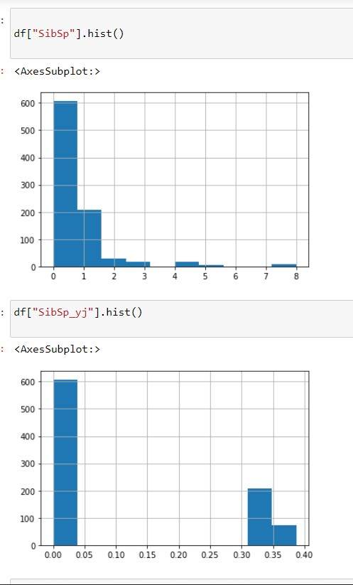

# EX-06-Feature-Transformation

# AIM:
To Perform the various feature transformation techniques on a dataset and save the data to a file. 

# Explanation:
Feature Transformation is a mathematical transformation in which we apply a mathematical formula to a particular column(feature) and transform the values which are useful for our further analysis.

 
# ALGORITHM:
### STEP 1
Read the given Data.
### STEP 2
Clean the Data Set using Data Cleaning Process.
### STEP 3
Apply Feature Transformation techniques to all the feature of the data set.
### STEP 4
Save the data to the file.


# CODE:
## For Data to Transform:
```python

# Done by: S Manoj Kumar
# Reg.No: 212221230056
import pandas as pd
import numpy as np
import matplotlib.pylab as plt
import seaborn as sns
import statsmodels.api as sm
import scipy.stats as stats
from sklearn.preprocessing import QuantileTransformer 
qt=QuantileTransformer(output_distribution='normal')
df=pd.read_csv("Data_to_Transform.csv")
df
df.isnull().sum()
df.skew()
dfmp=pd.DataFrame()
#for Moderate Positive Skew
#function transformation
dfmp["Moderate Positive Skew"]=df["Moderate Positive Skew"]
dfmp["MPS_log"]=np.log(df["Moderate Positive Skew"]) 
dfmp["MPS_rp"]=np.reciprocal(df["Moderate Positive Skew"])
dfmp["MPS_sqr"]=np.sqrt(df["Moderate Positive Skew"])
#power transformation
dfmp["MPS_yj"], parameters=stats.yeojohnson(df["Moderate Positive Skew"])
dfmp["MPS_bc"], parameters=stats.boxcox(df["Highly Positive Skew"]) 
#quantile transformation
dfmp["MPS_qt"]=qt.fit_transform(df[["Moderate Positive Skew"]])
dfmp.skew()

dfmp.drop('MPS_rp',axis=1,inplace=True)
dfmp.skew()

dfmp

#for Highly Positive Skew
#function transformation
dfhp=pd.DataFrame()
dfhp["Highly Positive Skew"]=df["Highly Positive Skew"]
dfhp["HPS_log"]=np.log(df["Highly Positive Skew"]) 
dfhp["HPS_rp"]=np.reciprocal(df["Highly Positive Skew"])
dfhp["HPS_sqr"]=np.sqrt(df["Highly Positive Skew"])
#power transformation
dfhp["HPS_yj"], parameters=stats.yeojohnson(df["Highly Positive Skew"])
dfhp["HPS_bc"], parameters=stats.boxcox(df["Highly Positive Skew"]) 
#quantile transformation
dfhp["HPS_qt"]=qt.fit_transform(df[["Highly Positive Skew"]])
dfhp.skew()

dfhp.drop('HPS_sqr',axis=1,inplace=True)
dfhp.skew()


dfhp.drop('HPS_sqr',axis=1,inplace=True)
dfhp.skew()

dfhp

#for Moderate Negative Skew
dfmn=pd.DataFrame()
#function transformation
dfmn["Moderate Negative Skew"]=df["Moderate Negative Skew"]
dfmn["MNS_rp"]=np.reciprocal(df["Moderate Negative Skew"])
dfmn["MNS_sq"]=np.square(df["Moderate Negative Skew"])
#power transformation
dfmn["MNS_yj"], parameters=stats.yeojohnson(df["Moderate Negative Skew"]) 
#quantile transformation
dfmn["MNS_qt"]=qt.fit_transform(df[["Moderate Negative Skew"]])
dfmn.skew()

dfmn.drop('MNS_rp',axis=1,inplace=True)
dfmn.skew()

dfmn

#for Highly Negative Skew
dfhn=pd.DataFrame()
#function transformation
dfhn["Highly Negative Skew"]=df["Highly Negative Skew"]
dfhn["HNS_rp"]=np.reciprocal(df["Highly Negative Skew"])
dfhn["HNS_sq"]=np.square(df["Highly Negative Skew"])
#phwer transformation
dfhn["HNS_yj"], parameters=stats.yeojohnson(df["Highly Negative Skew"]) 
#quantile transformation
dfhn["HNS_qt"]=qt.fit_transform(df[["Highly Negative Skew"]])
dfhn.skew()


dfhn.drop('HNS_rp',axis=1,inplace=True)
dfhn.skew()

dfhn

#graphical representation
#for Moderate Positive Skew
df["Moderate Positive Skew"].hist()
dfmp["MPS_log"].hist()
dfmp["MPS_sqr"].hist()
dfmp["MPS_bc"].hist()
dfmp["MPS_yj"].hist()
sm.qqplot(df['Moderate Positive Skew'],line='45')
plt.show()
sm.qqplot(dfmp['MPS_qt'],line='45')
plt.show()

#for Highly Positive Skew
df["Highly Positive Skew"].hist()
dfhp["HPS_log"].hist()
dfhp["HPS_rp"].hist()
dfhp["HPS_bc"].hist()
dfhp["HPS_yj"].hist()
sm.qqplot(df['Highly Positive Skew'],line='45')
plt.show()
sm.qqplot(dfhp['HPS_qt'],line='45')
plt.show()

#for Moderate Negative Skew
df["Moderate Negative Skew"].hist()
dfmn["MNS_sq"].hist()
dfmn["MNS_yj"].hist()
sm.qqplot(df['Moderate Negative Skew'],line='45')
plt.show()
sm.qqplot(dfmn['MNS_qt'],line='45')
plt.show()

#for Highly Negative Skew
df["Highly Negative Skew"].hist()
dfhn["HNS_sq"].hist()
dfhn["HNS_yj"].hist()
sm.qqplot(df['Highly Negative Skew'],line='45')
plt.show()
sm.qqplot(dfhn['HNS_qt'],line='45')
plt.show()


```
## For Titanic Dataset:

```python
import numpy as np
import pandas as pd
import matplotlib.pyplot as plt
import seaborn as sns
import statsmodels.api as sm
import scipy.stats as stats
from sklearn.preprocessing import QuantileTransformer 
qt=QuantileTransformer(output_distribution='normal',n_quantiles=891)

df=pd.read_csv("titanic_dataset.csv")
df

df.isnull().sum()

df.drop('Cabin',axis=1,inplace=True)
df.drop('Name',axis=1,inplace=True)
df.drop('Ticket',axis=1,inplace=True)
df.drop('PassengerId',axis=1,inplace=True)
df['Age']=df['Age'].fillna(df['Age'].median())
df['Embarked']=df['Embarked'].fillna(df['Embarked'].mode()[0])

df.isnull().sum()

from sklearn.preprocessing import OrdinalEncoder
embark=["C","S","Q"]
emb=OrdinalEncoder(categories=[embark])
df["Embarked"]=emb.fit_transform(df[["Embarked"]])\

from category_encoders import BinaryEncoder
be=BinaryEncoder()
df["Sex"]=be.fit_transform(df[["Sex"]])
df.skew()

df["Age_1"]=qt.fit_transform(df[["Age"]])
df["Survived_1"]=qt.fit_transform(df[["Survived"]])
df["Embarked_1"]=qt.fit_transform(df[["Embarked"]])
df["Pclass_sq"]=np.square(df["Pclass"])
df["Pclass_qt"]=qt.fit_transform(df[["Pclass"]])
df["SibSp_yj"], parameters=stats.yeojohnson(df["SibSp"])
df["SibSp_qt"]=qt.fit_transform(df[["SibSp"]])


df["Parch_yj"], parameters=stats.yeojohnson(df["Parch"])
df["Parch_qt"]=qt.fit_transform(df[["Parch"]])


df["Fare_yj"], parameters=stats.yeojohnson(df["Fare"])
df["Fare_qt"]=qt.fit_transform(df[["Fare"]])

df["Sex_yj"], parameters=stats.yeojohnson(df["Sex"])
df["Sex_qt"]=qt.fit_transform(df[["Sex"]])
df.skew()

df.drop('Sex_yj',axis=1,inplace=True)
df.drop('Pclass_qt',axis=1,inplace=True)
df.drop('SibSp_qt',axis=1,inplace=True)
df.drop('Parch_qt',axis=1,inplace=True)
df.drop('Fare_qt',axis=1,inplace=True)
df.skew()

df["Sex"].hist()
df["Sex_qt"].hist()
df["SibSp"].hist()
df["SibSp_yj"].hist()
df["Parch"].hist()
df["Parch_yj"].hist()
df["Fare"].hist()
df["Fare_yj"].hist()
df["Pclass"].hist()
df["Pclass_sq"].hist()

```

# OUTPUT:
## For Data to transform:
Data Set:


Skew


Graphical representation:


## For Titanic Dataset:

Data set:


Graphical representation:





# RESULT:
The various feature transformation techniques has been performed on the given datasets and the data are saved to a file.

